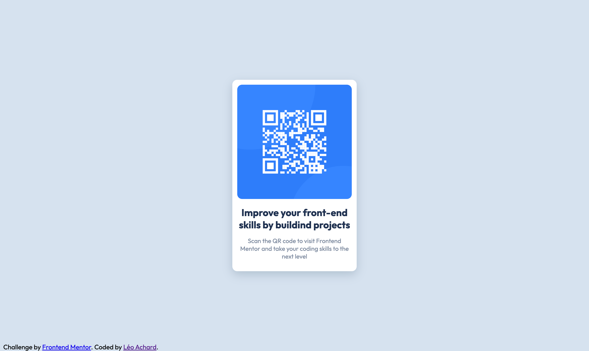

# Frontend Mentor - QR code component solution

This is a solution to the [QR code component challenge on Frontend Mentor](https://www.frontendmentor.io/challenges/qr-code-component-iux_sIO_H). Frontend Mentor challenges help you improve your coding skills by building realistic projects.

## Table of contents

- [Overview](#overview)
  - [Screenshot](#screenshot)
  - [Links](#links)
- [My process](#my-process)

  - [Built with](#built-with)

- [Author](#author)

## Overview

### Screenshot

### Links

- Live Site URL: [Add live site URL here](cdui.gobelins-pedago.fr/2023/leo/frontend-mentor/QR-Code/)

## My process

### Built with

- Semantic HTML5 markup
- CSS custom properties
- Flexbox
- Mobile-first workflow

## Author

- Website - [Léo Achard](https://cdui.gobelins-pedago.fr/2023/leo/portfolio_2023/)
- Frontend Mentor - [@yourusername](https://www.frontendmentor.io/profile/yourusername)
